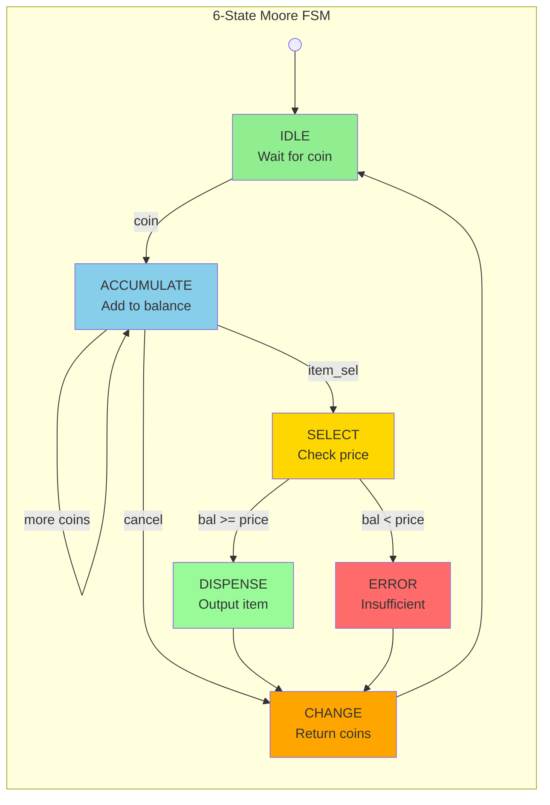

# Smart Vending Machine Controller (FSM Based)

A **Moore FSM-based** vending machine controller demonstrating complex state machine design, arithmetic logic, and professional verification methodology.

---

## 📋 Description

Designed a **Moore FSM controller** (6 states) handling concurrent inputs (Coin insertion, Item selection) and arithmetic operations (Balance/Change calculation).

Developed a comprehensive **Self-Checking Testbench** covering 10+ simulation scenarios, including corner cases (overflow protection, invalid inputs, async reset).

**Result:** Verified 100% logic correctness via Vivado Waveform Analysis, demonstrating strong **pre-silicon verification** skills.

---

## 🔧 Features

| Feature | Implementation |
|---------|----------------|
| FSM Type | Moore Machine (6 states) |
| States | IDLE, ACCUMULATE, SELECT, DISPENSE, CHANGE, ERROR |
| Coin Types | 5, 10, 20 units |
| Items | A (15), B (25), C (30) |
| Overflow Protection | Max balance 99 |
| Verification | Self-checking Testbench with 8 corner cases |

---

## 📊 Simulation Result

### Waveform (Vivado Behavioral Simulation)


*Complete testbench execution showing:*
- **coin[1:0]**: Coin insertion (5/10/20 units)
- **item_sel[1:0]**: Item selection (A/B/C)
- **balance[7:0]**: Real-time balance tracking
- **dispense[1:0]**: Item dispense output
- **change[7:0]**: Change calculation
- **state[2:0]**: FSM state transitions
- **pass_count**: Tests passing (8/8)

### Console Output (Self-Checking)

```
========== VENDING MACHINE TESTBENCH ==========

[PASS] Test 1: Insufficient funds for Item A
[PASS] Test 2: Buy Item A with change
[PASS] Test 3: Buy Item C exact change
[PASS] Test 4: Cancel with zero balance
[PASS] Test 5: Cancel and get refund
[PASS] Test 6: Overflow protection (bal<=99)
[PASS] Test 7: No coin, select item -> error
[PASS] Test 8: Reset clears balance

========== TEST SUMMARY ==========
Passed: 8 | Failed: 0
*** ALL TESTS PASSED! ***
```

---

## 📐 State Diagram




**State Encoding:**
| State | Binary | Description |
|-------|--------|-------------|
| IDLE | `3'b000` | Waiting for coin |
| ACCUMULATE | `3'b001` | Accumulating balance |
| SELECT | `3'b010` | Checking price |
| DISPENSE | `3'b011` | Dispensing item |
| CHANGE | `3'b100` | Returning change |
| ERROR | `3'b101` | Insufficient funds |

---

## 📁 Files

| File | Description |
|------|-------------|
| `vending_machine.v` | Main FSM controller module |
| `tb_vending_machine.v` | Self-checking testbench |
| `constraints.xdc` | PYNQ-Z2 pin mapping |
| `docs/waveform_simulation.png` | Simulation evidence |

---

## 🚀 How to Simulate

```bash
1. Open Vivado → Create RTL Project
2. Add Sources: vending_machine.v, tb_vending_machine.v
3. Run Simulation → Behavioral Simulation
4. Check Tcl Console for PASS/FAIL results
5. View Waveform for signal analysis
```

---

## 👤 Author

**Bì Duy Tân** - FPT Jetking Academy  
Chip Design Technology - Semester 2 (2025-2027)
