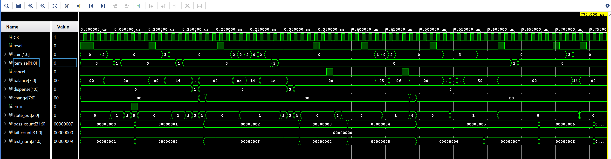
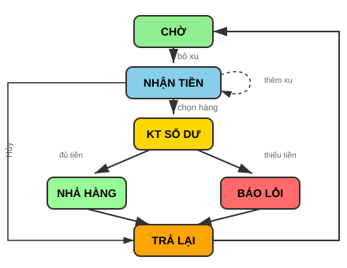

# Vending Machine Controller (FSM)

A Moore FSM design for a vending machine. Includes a self-checking testbench to verify all state transitions.

## Overview
Handled inputs for coins (5, 10, 20) and item selection (A, B, C). Includes balance tracking and change calculation. 

Verified everything in Vivado with 8+ test scenarios covering normal purchase, insufficient funds, and cancel/refund.

---

## Features
- FSM: Moore Machine (6 states)
- Coins: 5, 10, 20
- Items: A(15), B(25), C(30)
- Safeguards: Max balance 99, verified with 8 directed/self-checking scenarios

---

## Simulation

### Waveform (Vivado Behavioral Simulation)



*Complete testbench execution showing:*
- **coin[1:0]**: Coin insertion (5/10/20 units)
- **item_sel[1:0]**: Item selection (A/B/C)
- **balance[7:0]**: Real-time balance tracking
- **dispense[1:0]**: Item dispense output
- **change[7:0]**: Change calculation
- **state[2:0]**: FSM state transitions
- **pass_count**: Tests passing (8/8)

```
--- Vending machine TB ---

[PASS] Test 1: Insuff fund for Item A
[PASS] Test 2: Buy Item A with change
[PASS] Test 3: Buy Item C exact change
[PASS] Test 4: Cancel with zero balance
[PASS] Test 5: Cancel and get refund
[PASS] Test 6: Overflow protection (bal<=99)
[PASS] Test 7: No coin, select item B -> Ignore
[PASS] Test 8: Reset clears balance

--- Summary ---
Total: 8
Pass: 8
Fail: 0
*** ALL TESTS PASSED! ***
```

---

## State Diagram




**State Encoding:**
| State | Binary | Description |
|-------|--------|-------------|
| IDLE | `3'b000` | Waiting for coin |
| ACCUMULATE | `3'b001` | Accumulating balance |
| SELECT | `3'b010` | Checking price |
| DISPENSE | `3'b011` | Dispensing item |
| CHANGE | `3'b100` | Returning change |
| ERROR | `3'b101` | Insufficient funds |

---

## Files

| File | Description |
|------|-------------|
| `vending_machine.v` | Main FSM controller module |
| `tb_vending_machine.v` | Self-checking testbench |
| `constraints_vending_machine.xdc` | PYNQ-Z2 pin mapping |
| `docs/waveform_vending_fixed.png` | Simulation evidence |

---

## Running Simulation

```bash
1. Open Vivado → Create RTL Project
2. Add Sources: vending_machine.v, tb_vending_machine.v
3. Run Simulation → Behavioral Simulation
4. Check Tcl Console for PASS/FAIL results
5. View Waveform for signal analysis
```

---

## 👤 Author

**Bì Duy Tân** - FPT Jetking Academy  
Chip Design Technology - Semester 2 (2025-2027)

