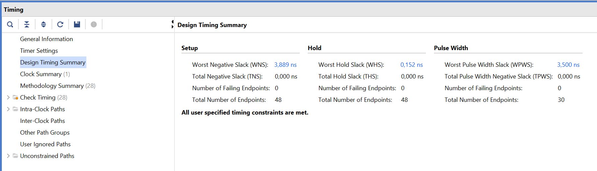

# FPGA-PYNQ-Z2-Labs

A collection of FPGA lab projects developed on **Xilinx PYNQ-Z2** board using **Vivado**. 
Demonstrates skills in **Digital Design**, **Timing Closure**, **Tcl Automation**, and **SystemVerilog Verification**.

---

## 🎯 Highlight Project: Smart Vending Machine FSM

> **6-state Moore FSM Controller** with Self-Checking Testbench

**Key Features:**
- 6-state Moore FSM: `IDLE → ACCUMULATE → SELECT → DISPENSE → CHANGE → ERROR`
- Self-Checking Testbench with 8 corner case scenarios
- 100% logic verification via automated PASS/FAIL output
- **Feature:** [🐛 How I Debug Timing Violations](./HOW_I_DEBUG_TIMING.md) (Methodology Guide)

### Simulation Waveform (Vivado)

*Testbench running all 8 scenarios: coin insertion, item selection, balance tracking, dispense, and change calculation*

### State Diagram (Moore FSM)


**State Descriptions:**
| State | Function | Output |
|-------|----------|--------|
| `IDLE` | Wait for coin insertion | All outputs = 0 |
| `ACCUMULATE` | Add coins to balance | Update balance |
| `SELECT` | Check if balance >= price | - |
| `DISPENSE` | Activate motor, subtract price | dispense = item_code |
| `CHANGE` | Return remaining balance | change = balance |
| `ERROR` | Signal insufficient funds | error = 1 |

📂 [**View Vending Machine Code →**](./04_Vending_Machine)

---

## 📂 All Projects

| # | Project | Description | Skills Demonstrated |
|---|---------|-------------|---------------------|
| 01 | [LED Blink](./01_LED_Blink) | Running LED pattern | Clock divider, Shift register |
| 02 | [7-Segment Counter](./02_7Segment_Counter) | 0000-9999 auto counter | FSM, Multiplexing, BCD |
| 03 | [Button Up/Down](./03_Button_UpDown_Counter) | Button-controlled counter | Debounce, Edge detection |
| 04 | [**Vending Machine**](./04_Vending_Machine) | **Moore FSM Controller** | **Complex FSM, ALU, Verification** |
| 05 | [**Verification**](./verification) | **SystemVerilog Testbench** | **Assertions, Covergroups, Randomization** |
| 06 | [**Mini-UVM**](./uvm_example) | **UVM Verification Environment** | **Driver, Monitor, Scoreboard, Coverage** |

---

## 🛠 Tools & Automation

This repository includes custom scripts to automate the **Timing Closure** and **Reporting** flow, commonly used in EDA/FPGA Applications Engineering.

### 1. Tcl Script: Report Timing & Utilization
Located in `tools/report_timing.tcl`. Run this in Vivado Tcl Console or Batch mode to generate standard reports.

```tcl
vivado -mode batch -source tools/report_timing.tcl -tclargs MyProject impl_1
```

### 2. Python Script: Parse Timing Report
Located in `tools/collect_timing.py`. identifying WNS/TNS metrics from generated text reports.

```bash
python tools/collect_timing.py reports/timing_summary.rpt
```

**Output Example:**
```text
----------------------------------------
Timing Report Summary: reports/timing_summary.rpt
----------------------------------------
WNS (Worst Negative Slack): 3.889 ns
Status: PASS
TNS (Total Negative Slack): 0.0 ns
----------------------------------------
```

---

## 📊 Testbench Results (Self-Checking)

```
========== VENDING MACHINE TESTBENCH ==========

[PASS] Test 1: Insufficient funds for Item A
[PASS] Test 2: Buy Item A with change
[PASS] Test 3: Buy Item C exact change
[PASS] Test 4: Cancel with zero balance
[PASS] Test 5: Cancel and get refund
[PASS] Test 6: Overflow protection (bal<=99)
[PASS] Test 7: No coin, select item -> error
[PASS] Test 8: Reset clears balance

========== TEST SUMMARY ==========
Total Tests: 8
Passed: 8
Failed: 0
*** ALL TESTS PASSED! ***
```

---

## 🛠 Hardware

- **Board**: PYNQ-Z2 (Xilinx Zynq-7000, xc7z020clg400-1)
- **Clock**: 125 MHz
- **Tools**: Vivado 2020.2+

---

## ⏱ Timing Report (Vivado Implementation)



| Metric | Value | Status |
|--------|-------|--------|
| **WNS (Setup)** | +3.889 ns | ✅ PASSED |
| **WHS (Hold)** | +0.152 ns | ✅ PASSED |
| **WPWS (Pulse Width)** | +3.500 ns | ✅ PASSED |
| **Failing Endpoints** | 0 | ✅ PERFECT |

> **"All user specified timing constraints are met."**

📂 [View Constraint File →](./04_Vending_Machine/constraints_vending_machine.xdc)

---

## 📂 Project Structure

```
FPGA-PYNQ-Z2-Labs/
├── tools/                  # [NEW] Automation Scripts
│   ├── report_timing.tcl   # Vivado Tcl script
│   └── collect_timing.py   # Python parser
│
├── verification/           # [NEW] SystemVerilog Verification
│   └── top_tb.sv           # Testbench with Assertions & Coverage
│
├── uvm_example/            # [NEW] Mini-UVM Verification Environment
│   ├── rtl/counter.sv      # DUT: 4-bit counter
│   ├── tb/                 # UVM components (Driver, Monitor, Scoreboard)
│   ├── top/tb_top.sv       # Top-level testbench
│   └── run_sim.sh          # Multi-tool run script (VCS/Questa/XSIM)
│
├── 01_LED_Blink/
│   ├── clk_divider.v      # Clock divider module
│   ├── led_blink.v        # Top module (shift register pattern)
│   ├── tb_led_blink.v     # Testbench
│   └── constraints.xdc    # PYNQ-Z2 pin mapping
│
├── 02_7Segment_Counter/
│   ├── top.v              # Top module
│   ├── digits.v           # BCD counter (0-9999)
│   ├── seg7_control.v     # 4-digit multiplexer FSM
│   └── tenHz_gen.v        # Clock generator
│
├── 03_Button_UpDown_Counter/
│   ├── top.v              # Top module
│   ├── btn_debounce.v     # Button debounce logic
│   ├── counter_4bit.v     # 4-bit up/down counter
│   └── seg7_led.v         # Hex to 7-segment decoder
│
├── 04_Vending_Machine/     ★ HIGHLIGHT
│   ├── vending_machine.v  # 6-state Moore FSM
│   ├── tb_vending_machine.v # Self-checking testbench
│   └── README.md          # State diagram & test scenarios
│
└── docs/
    ├── fsm_diagram.svg     # State diagram for Vending Machine
    └── timing_report.png   # Vivado timing analysis result
```

---

## 🚀 How to Use

### Simulation (Vivado)
```
1. Create RTL Project in Vivado
2. Add vending_machine.v + tb_vending_machine.v
3. Run Behavioral Simulation
4. Check Console for PASS/FAIL results
```

### Simulation Walkthrough (Verification Evidence)
> **🎥 [Watch Video Demo](./docs/FPGA_Simulation_walkthrough.mp4)** (Click to download/view raw file)

Since physical hardware is not required to verify logic correctness, we rely on **Vivado Behavioral Simulation**. The video demonstrates:
1. **Waveform Analysis**: Observing `current_state` transitions `IDLE` → `ACCUMULATE`.
2. **Logic Verification**: Confirming correct dispensing and change calculation.
3. **Automated Testbench**: Showing `*** ALL TESTS PASSED ***` in Tcl Console.

> **Note:** The included `timing_summary.rpt` proves that the design successfully passed Place & Route with positive slack, confirming physical feasibility.

### Run Timing Automation
```bash
# Generate report via Vivado
vivado -mode batch -source tools/report_timing.tcl -tclargs MyProject impl_1

# Parse results
python tools/collect_timing.py reports/timing_summary.rpt
```

---

## 👤 Author

**Bì Duy Tân**  
FPT Jetking Academy - Chip Design Technol   [](https://github.com/duytan1412/FPGA-PYNQ-Z2-Labs/actions/workflows/ci.yml)ogy  
📧 duytan2903@gmail.com  
🔗 [LinkedIn](https://linkedin.com/in/bi-duy-tan) | [GitHub](https://github.com/duytan1412)

---

## 📄 License

MIT License - Free to use for educational purposes.
