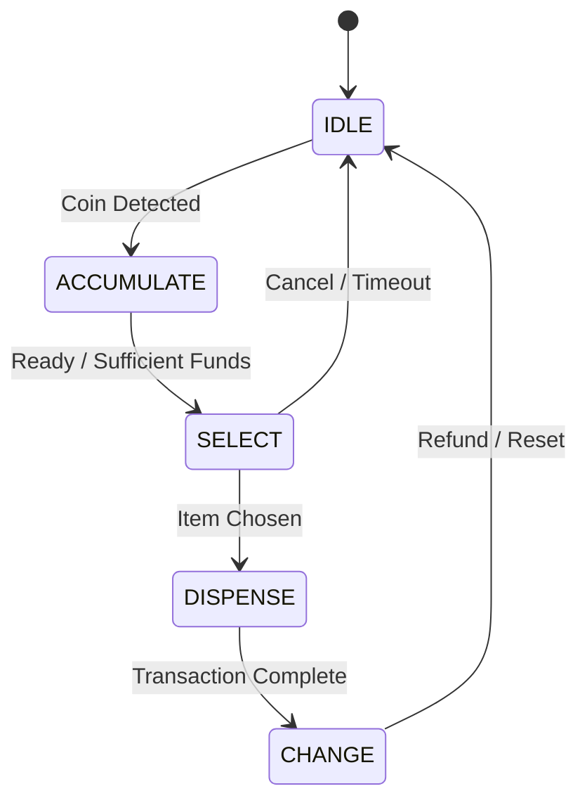
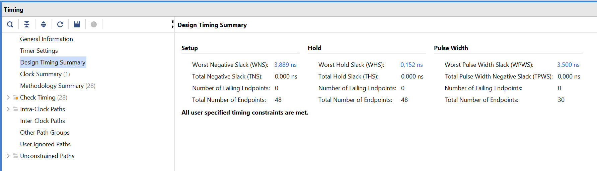

# FPGA-PYNQ-Z2-Labs
This repository contains FPGA design projects for the Xilinx PYNQ-Z2 board. It focuses on RTL development, timing closure (STA) with Vivado, and automation scripting.


---

## Recruiter Quick View

| Evidence | Link |
|---|---|
| Vending FSM RTL | [`04_Vending_Machine/vending_machine.v`](./04_Vending_Machine/vending_machine.v) |
| Self-checking testbench | [`04_Vending_Machine/tb_vending_machine.v`](./04_Vending_Machine/tb_vending_machine.v) |
| Waveform evidence | [`04_Vending_Machine/docs/waveform_vending_fixed.png`](./04_Vending_Machine/docs/waveform_vending_fixed.png) |
| Timing report screenshot | [`docs/timing_report.png`](./docs/timing_report.png) |
| Timing automation Tcl | [`tools/report_timing.tcl`](./tools/report_timing.tcl) |
| Simulation runner | [`scripts/run_sim.ps1`](./scripts/run_sim.ps1) |
| CI workflow | [`.github/workflows/ci.yml`](./.github/workflows/ci.yml) |

> The `verification/` directory is reserved for future shared test assets. Current executable verification evidence lives in each lab folder and the CI workflow.
---

## Design Highlights (Verification Evidence)

> [!IMPORTANT]
> **Timing Closure Reached**:
> - **WNS (Worst Negative Slack)**: **+3.889 ns** (Estimated FMAX ~150MHz+)
> - **Evidence**: [View Timing Report Screenshot](./docs/timing_report.png) | [Tcl Automation Script](./tools/report_timing.tcl)

## System Architecture

This project focuses on the hardware implementation of finite-state machine (FSM) controllers on the PYNQ-Z2 board:
- **Core Controller**: 6-state Moore Machine handling vending machine state transitions.
- **Timing Optimization**: Utilized Vivado STA (Static Timing Analysis) to optimize critical paths and ensure closure.
- **Automation Pipeline**: Tcl-based flow for automated Utilization and Timing report generation.

---

## Vending Machine FSM
A 6-state Moore machine controller with a self-checking testbench.

### State Diagram (Mermaid)

```mermaid
stateDiagram-v2
    [*] --> IDLE
    IDLE --> ACCUMULATE : Coin Detected
    ACCUMULATE --> SELECT : Ready / Sufficient Funds
    SELECT --> DISPENSE : Item Chosen
    DISPENSE --> CHANGE : Transaction Complete
    CHANGE --> IDLE : Refund / Reset
    SELECT --> IDLE : Cancel / Timeout
```

### Key Engineering Highlights
*   Static Timing Analysis (STA): Achieved a positive slack of +3.889 ns through path optimization in Vivado.
*   Timing Debugging: Detailed walkthrough on fixing setup/hold violations in [HOW_I_DEBUG_TIMING.md](./HOW_I_DEBUG_TIMING.md).
*   Self-Checking Testbench: Automated verification with status reporting for 8 distinct scenarios.

[Go to project files](./04_Vending_Machine)

---

See [PORTFOLIO.md](./PORTFOLIO.md) for the scholarship-focused evidence map and IC-design relevance summary.

## Projects List

| # | Project | Notes |
|---|---------|-------|
| 01 | [LED Blink](./01_LED_Blink) | Clock dividers |
| 02 | [7-Segment Counter](./02_7Segment_Counter) | Multiplexing FSM |
| 03 | [Button Up/Down](./03_Button_UpDown_Counter) | Debouncing |
| 04 | [Vending Machine](./04_Vending_Machine) | Moore FSM & ALU |

---

## Automation Scripts

This repository includes custom scripts to automate the Timing Closure and Reporting flow, commonly used in EDA/FPGA Applications Engineering.

### 1. Tcl Script: Report Timing & Utilization
Located in `tools/report_timing.tcl`. Run this in Vivado Tcl Console or Batch mode to generate standard reports.

```tcl
vivado -mode batch -source tools/report_timing.tcl -tclargs MyProject impl_1
```

### 2. Python Script: Parse Timing Report
Located in `tools/collect_timing.py`. Identifying WNS/TNS metrics from generated text reports.
> *Note: This Python parser approach is highly scalable for automating UVM regression log analysis.*

```bash
python tools/collect_timing.py reports/timing_summary.rpt
```

**Output Example:**
```text
----------------------------------------
Timing Report Summary: reports/timing_summary.rpt
----------------------------------------
WNS (Worst Negative Slack): 3.889 ns
Status: PASS
TNS (Total Negative Slack): 0.0 ns
----------------------------------------
```

---

## TB Results

```
========== VENDING MACHINE TESTBENCH ==========

[PASS] Test 1: Insufficient funds for Item A
[PASS] Test 2: Buy Item A with change
[PASS] Test 3: Buy Item C exact change
[PASS] Test 4: Cancel with zero balance
[PASS] Test 5: Cancel and get refund
[PASS] Test 6: Overflow protection (bal<=99)
[PASS] Test 7: No coin, select item -> error
[PASS] Test 8: Reset clears balance

========== TEST SUMMARY ==========
Total Tests: 8
Passed: 8
Failed: 0
--- ALL TESTS PASSED! ---
```

---

## Hardware Used

- **Board**: PYNQ-Z2 (Xilinx Zynq-7000, xc7z020clg400-1)
- **Clock**: 125 MHz
- **Tools**: Vivado 2020.2+

---

## Timing Summary



| Metric | Value | Status |
|--------|-------|--------|
| WNS (Setup) | +3.889 ns | PASSED |
| WHS (Hold) | +0.152 ns | PASSED |
| WPWS (Pulse Width) | +3.500 ns | PASSED |
| Failing Endpoints | 0 | PASSED |

> **"All user specified timing constraints are met."**

📂 [View Constraint File →](./04_Vending_Machine/constraints_vending_machine.xdc)

---

## Repo Structure

```
FPGA-PYNQ-Z2-Labs/
├── tools/                  # [NEW] Automation Scripts
│   ├── report_timing.tcl   # Vivado Tcl script
│   └── collect_timing.py   # Python parser
│
├── 01_LED_Blink/
│   ├── clk_divider.v      # Clock divider module
│   ├── led_blink.v        # Top module (shift register pattern)
│   ├── tb_led_blink.v     # Testbench
│   └── constraints.xdc    # PYNQ-Z2 pin mapping
│
├── 02_7Segment_Counter/
│   ├── top.v              # Top module
│   ├── digits.v           # BCD counter (0-9999)
│   ├── seg7_control.v     # 4-digit multiplexer FSM
│   └── tenHz_gen.v        # Clock generator
│
├── 03_Button_UpDown_Counter/
│   ├── top.v              # Top module
│   ├── btn_debounce.v     # Button debounce logic
│   ├── counter_4bit.v     # 4-bit up/down counter
│   └── seg7_led.v         # Hex to 7-segment decoder
│
├── 04_Vending_Machine/     [HIGHLIGHTED]
│   ├── vending_machine.v  # 6-state Moore FSM
│   ├── tb_vending_machine.v # Self-checking testbench
│   └── README.md          # State diagram & test scenarios
│
└── docs/
    ├── fsm_diagram.svg     # State diagram for Vending Machine
    └── timing_report.png   # Vivado timing analysis result
```

---

## Setup & Running

### Simulation (Vivado)
```
1. Create RTL Project in Vivado
2. Add vending_machine.v + tb_vending_machine.v
3. Run Behavioral Simulation
4. Check Console for PASS/FAIL results
```

### Simulation Demo
[**Watch the Walkthrough Video →**](docs/FPGA_Simulation_walkthrough.mp4)

*Tested in Vivado simulator. The video demonstrates state transitions and automated PASS/FAIL logging.*

---

### Run Timing Automation
```bash
# Generate report via Vivado
vivado -mode batch -source tools/report_timing.tcl -tclargs MyProject impl_1

# Parse results
python tools/collect_timing.py reports/timing_summary.rpt
```

---

## Author

**Bì Duy Tân** (Junior Verification Engineer)
FPT Jetking Academy - Chip Design Technology
📧 duytan2903@gmail.com
🔗 [LinkedIn](https://linkedin.com/in/bi-duy-tan) | [GitHub](https://github.com/duytan1412)

---

## License

MIT License - see [LICENSE](./LICENSE).

